# 2025年排名前18的防关联浏览器精选列表(最新整理)

多账号运营者在管理Facebook、亚马逊、TikTok等平台账户时,经常面临指纹识别、账号关联封禁和设备限制等棘手问题。本文精选18款专业防关联浏览器,从指纹伪装技术、团队协作能力、自动化支持到跨平台兼容性进行全面对比。这些工具通过创建独立浏览器环境,让单台设备模拟数十台真实设备,降低80%以上的账号封禁风险,节省购买多台设备的硬件成本。无论您是电商卖家、社媒营销人员还是数据采集工程师,都能找到适合当前业务规模和技术水平的解决方案。

## **[Octo Browser](https://octobrowser.net)**

专业级防关联浏览器,以高质量指纹伪装和团队管理著称。

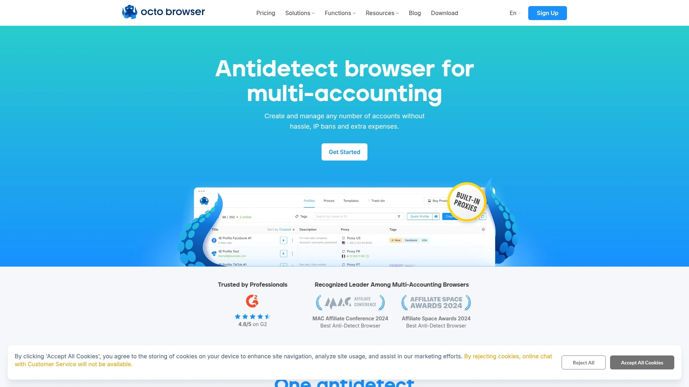

Octo Browser采用先进的指纹生成算法,精准模拟真实用户的Canvas、WebGL、AudioContext等20多个浏览器特征参数。平台保持99.995%的系统稳定性,确保多账号运营的连续性。内置代理商店提供快速购买通道,支持HTTP、SOCKS5等多种协议类型。

团队管理功能支持精细化权限分配,成员可共享指定配置文件而不泄露敏感信息。基于Chromium内核的快速更新策略确保与主流Chrome版本保持同步,避免因浏览器版本过旧而被网站识别。资源定制选项灵活,用户可根据实际需求调整CPU、内存等硬件指纹参数。

定价从每月29欧元起,支持10个配置文件和无限团队成员。高级版(79欧元/月)提供100个配置文件和自动化API接入。企业版(169欧元/月)解锁300个配置文件和专属技术支持。所有配置文件保留6个月,支持信用卡和加密货币支付。平台提供Android设备指纹模拟功能,特别适合社交媒体营销和移动端业务场景。客户服务团队响应迅速,为新手提供详细操作指导,帮助高级用户优化复杂配置。数据安全通过双因素认证和配置文件密码保护双重保障。

## **[Multilogin](https://multilogin.com)**

企业级多账号管理方案,市场认可度高且功能成熟。

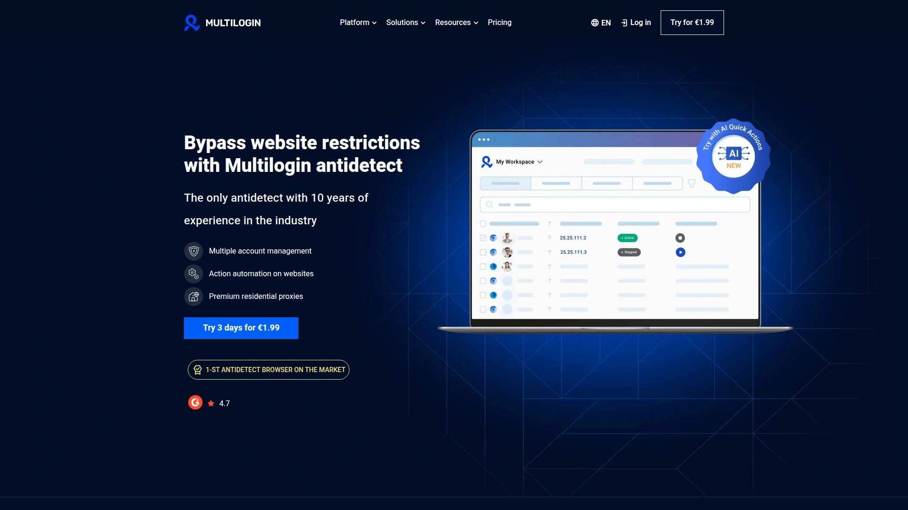

Multilogin自2015年进入市场,为企业客户提供稳定可靠的多账号解决方案。最新Multilogin X版本采用云端架构,支持跨设备同步配置文件。内置住宅代理服务简化网络配置流程,用户无需单独购买第三方代理。

平台提供Mimic(基于Chromium)和Stealthfox(基于Firefox)双浏览器内核选择,覆盖更广泛的网站兼容场景。高级指纹伪装技术遮蔽25个以上的追踪参数,每日在50多个主流网站进行检测测试。团队协作功能支持无限座位数和基于角色的权限管理,适合大型组织使用。

定价采用年付优惠模式,Solo套餐约5.68美元/月(年付),提供100个配置文件。提供1.99美元试用期,降低用户决策风险。完整的Android设备模拟能力满足TikTok、Instagram等移动优先平台需求。自动化支持Selenium和Puppeteer等主流框架,便于技术团队集成现有工作流。适合需要长期稳定服务且预算充足的中大型企业。

## **[GoLogin](https://gologin.com)**

界面友好的跨平台解决方案,提供永久免费版本。

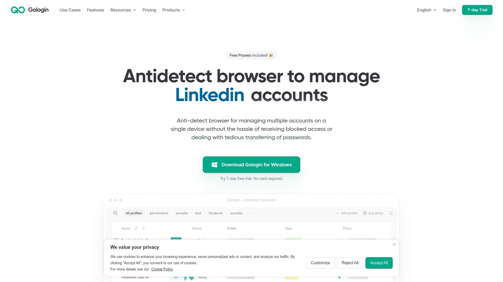

GoLogin支持Windows、macOS、Linux、Android和Web应用程序,是市场上平台覆盖最全面的选择之一。永久免费套餐包含3个配置文件和5个免费代理(覆盖主流地理位置),无需信用卡即可开始使用。G2评价显示其市场声誉位居行业前列,超过15000家企业客户管理着150万个账户。

自研Orbita浏览器引擎专门优化指纹保护,24/7人工客户支持对免费和付费用户一视同仁。API和自动化功能在免费版本中完全开放,无额外限制。云端配置文件选项让用户在任意设备上访问账户设置,本地配置文件则提供无限存储空间。

付费套餐从49美元/月起步,包含100个配置文件。7天免费试用无需绑定支付方式。用户界面设计简洁直观,非技术人员也能快速掌握基本操作。代理集成流程顺畅,支持第三方代理服务商的灵活接入。特别适合预算有限的个人创业者和小型团队快速启动多账号业务。

## **[AdsPower](https://www.adspower.com)**

技术驱动的重量级工具,RPA自动化能力突出。

AdsPower由中国团队开发,提供强大的机器人流程自动化(RPA)功能和精密的代理管理系统。平台支持批量创建、导入和管理数百个配置文件,适合大规模账号运营场景。内置任务调度器可预设自动化操作流程,减少重复性手工劳动。

指纹伪装覆盖WebRTC、Canvas、字体列表等核心识别点,配合详细的配置选项满足高级用户的定制需求。团队协作支持权限分级和操作日志记录,便于管理层监督成员活动。Sun浏览器和Flower浏览器双内核架构适应不同网站环境。

免费版本提供5个配置文件,付费套餐从每月约9美元起。系统功能完整但界面复杂度较高,新用户需要投入时间学习操作逻辑。对于技术背景较强且需要深度自动化的专业用户,AdsPower的功能深度具有吸引力。移动设备模拟和批量操作工具帮助效率提升30%以上。

## **[Dolphin Anty](https://dolphin-anty.com)**

专为社交媒体营销设计的专业工具,Facebook和TikTok优化显著。

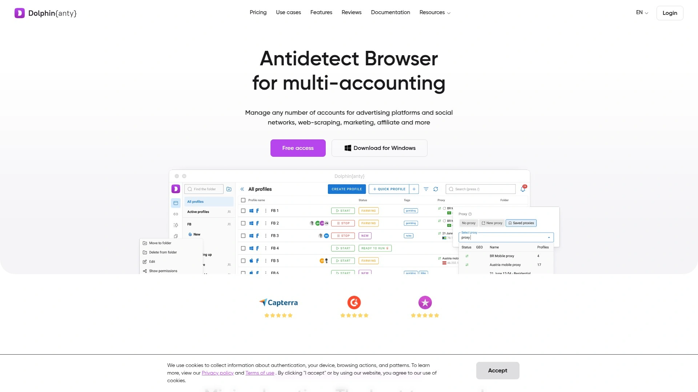

Dolphin Anty由资深营销从业者开发,深度理解社交平台的反作弊机制。免费版本提供10个配置文件且无需信用卡验证,降低入门门槛。配置文件共享功能允许团队成员直接转移完整环境配置,包括Cookie、扩展和书签。

平台针对Facebook广告账户管理进行专项优化,减少因指纹异常导致的广告审核失败。批量导入导出功能简化配置文件迁移流程。代理检测器自动验证代理可用性,避免使用失效IP地址。

定价透明且具有竞争力,付费版从每月约89美元起。类Chrome界面降低学习成本,用户无需适应全新操作逻辑。自动化支持Selenium集成,便于执行重复性社交媒体任务。同步器功能让多个配置文件执行相同操作,提升批量处理效率。适合专注社交媒体营销和内容分发的中小型团队。

## **[Incogniton](https://incogniton.com)**

平衡性能与价格的中端选择,支持无限配置文件。

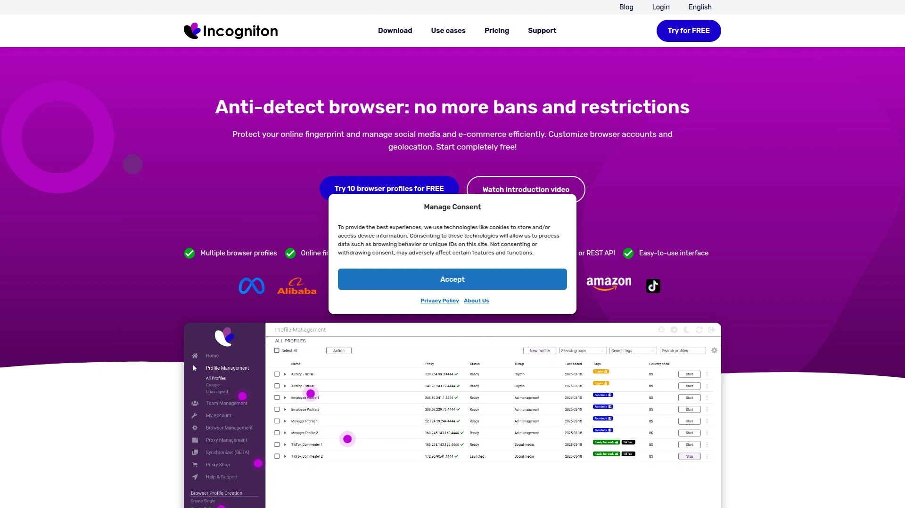

Incogniton采用基于Chromium的内核,提供稳定的浏览体验和广泛的网站兼容性。所有付费套餐均包含无限数量的配置文件创建能力,仅根据同时运行的配置文件数量收费。这种计费模式特别适合拥有大量账户但不需要同时操作的用户。

指纹管理涵盖Canvas、WebGL、音频环境、字体和用户代理等关键参数。团队协作功能支持配置文件共享和权限控制。内置Selenium和Puppeteer集成接口,方便开发者实现自动化脚本。

免费版本提供10个配置文件,付费套餐从每月约29.99美元起(支持10个同步配置)。批量操作工具允许一键创建、删除或修改多个配置文件。代理支持HTTP、HTTPS和SOCKS5协议。用户界面清爽简洁,学习曲线温和。数据本地存储选项确保敏感信息不离开用户设备。适合需要管理大量账户但预算适中的电商卖家和营销团队。

## **[Kameleo](https://kameleo.io)**

移动端支持领先的隐秘浏览方案,兼容多浏览器内核。

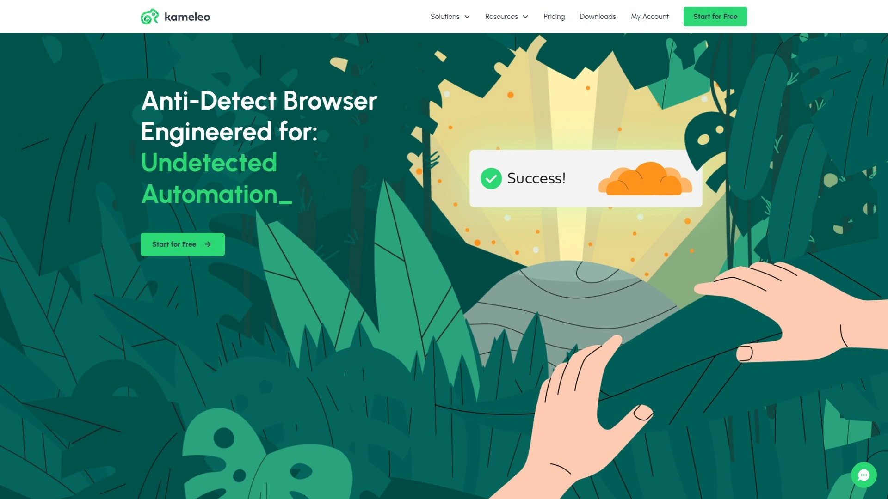

Kameleo提供独特的移动应用支持,是为数不多覆盖iOS和Android平台的防关联浏览器。桌面版兼容Chrome、Firefox、Edge和Safari多种浏览器内核,灵活适应不同网站的浏览器要求。随着移动设备占全球网络流量60%以上,移动端指纹伪装变得至关重要。

配置选项极其丰富,用户可精细调整地理位置、时区、语言、Canvas指纹、WebGL渲染器等数十个参数。自动指纹生成功能为不熟悉技术细节的用户提供开箱即用体验。Canvas指纹欺骗和JavaScript绕过技术防止网站通过HTML5追踪用户身份。

支持SSH、HTTP和SOCKS5多种代理协议,移动应用端同样可配置代理保护。虚拟配置文件管理允许为每个账户独立设置Cookie、历史记录和扩展程序。Web自动化支持Selenium Stealth Webdriver和Puppeteer框架。定价从每月约59欧元起。对于需要同时管理桌面和移动账户的用户,Kameleo的跨平台能力具有独特价值。

## **[Undetectable.io](https://undetectable.io)**

不限配置文件数量的经济型选择,按云端配置收费。

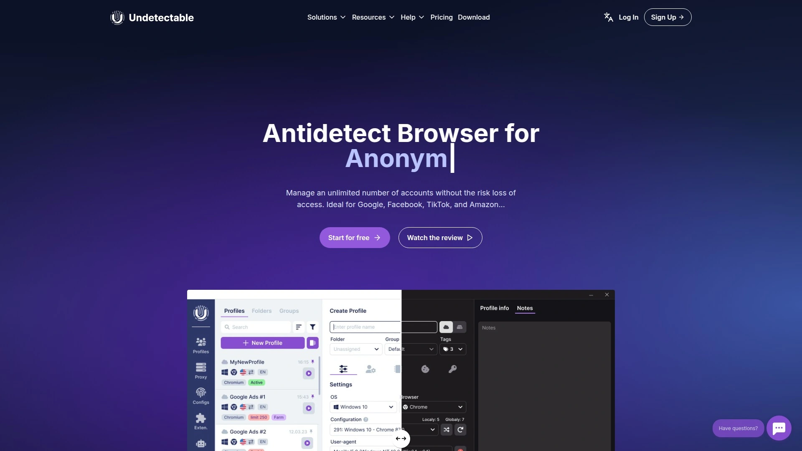

Undetectable.io采用差异化定价策略,本地配置文件完全免费且数量无限,仅对云端同步配置文件收费。这种模式让预算有限的用户能以极低成本启动多账号业务。平台强调身份保护,通过修改IP地址、浏览器指纹和设备特征实现匿名浏览。

Windows和Mac系统均有原生客户端支持。指纹定制包括Canvas、WebGL、字体、时区等核心参数。简化的用户界面降低技术门槛,新手可在5分钟内创建首个配置文件。批量导入Cookie功能加速账户初始化流程。

免费版本功能完整,付费套餐从每月约9美元起,主要解锁云端存储和团队协作能力。自动化API文档完善,支持与第三方工具集成。特别适合个人工作室和预算敏感的初创团队。系统资源占用较低,中等配置电脑即可流畅运行数十个配置文件。代理配置向导简化网络设置流程。

## **[GeeLark](https://www.geelark.com)**

云端Android模拟专家,专注移动社交媒体管理。

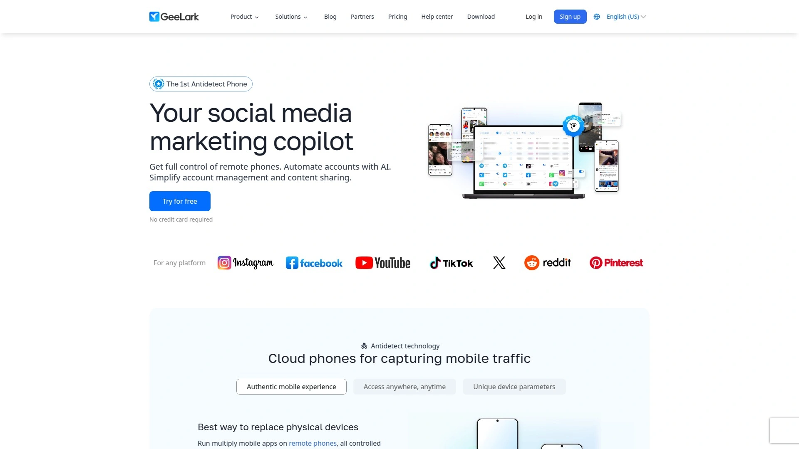

GeeLark独辟蹊径,专注于提供云端Android设备模拟服务而非传统桌面浏览器方案。用户无需在本地设备安装任何软件,直接通过网页访问完整的Android系统环境。这种云端架构消除了设备性能限制,即使低配电脑也能同时管理数十个移动账户。

真实Android系统环境而非简单模拟器,应用程序表现与物理设备完全一致。特别适合TikTok、Instagram、WhatsApp等移动优先平台的账号运营。每个云端设备拥有独立的设备ID、IMEI、Android版本等硬件指纹。

支持安装任意Android应用,包括需要Google Play认证的应用程序。GPS位置模拟和时区设置让账户看起来位于目标市场。团队成员可远程协作管理相同设备,无需物理交接。

定价按云端设备数量计费,从每月约6美元/设备起。免费试用期提供完整功能体验。对于专注移动社交媒体营销且不希望维护物理设备的团队,GeeLark的云端方案极具吸引力。网络延迟和流量消耗需要稳定宽带支持。

## **[MoreLogin](https://www.morelogin.com)**

成本友好的多账号管理工具,批量操作效率高。

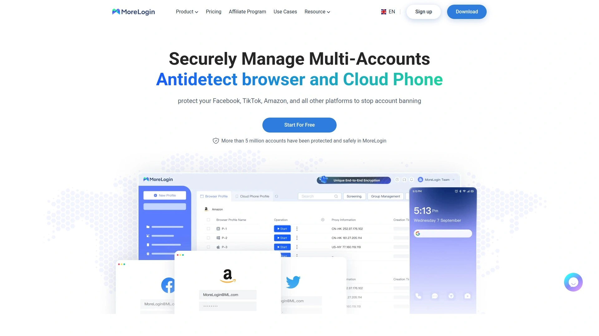

MoreLogin采用数字指纹技术保护账户免受关联检测,广泛应用于电商、社媒和广告投放场景。平台强调操作便捷性,批量创建配置文件功能可在数分钟内生成数十个独立环境。Cookie导入导出工具简化账户迁移流程。

支持配置文件回收站机制,误删除的配置可在30天内恢复。克隆浏览器功能快速复制现有配置,节省重复设置时间。代理测试器批量验证代理列表可用性。团队协作支持云端同步和活动日志追踪。

定价从每月约9美元起,免费版本提供2个配置文件。用户界面采用中文为主的多语言设计,降低国内用户的语言障碍。技术文档和视频教程丰富,新手可快速掌握核心功能。适合预算有限且需要快速上手的中小型电商卖家和营销团队。系统稳定性和更新频率处于行业中等水平。

## **[VMLogin](https://www.vmlogin.us)**

虚拟浏览器配置文件管理器,替代多台物理设备方案。

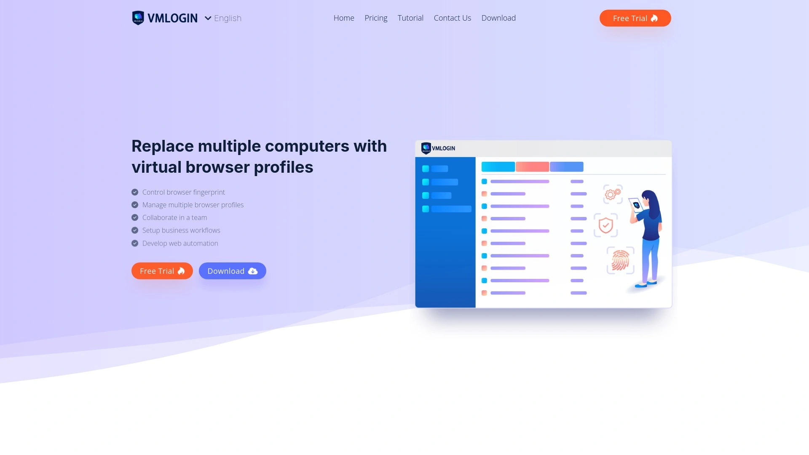

VMLogin通过虚拟浏览器配置文件技术,让单台计算机模拟多台独立设备的浏览行为。每个配置文件拥有独立的Cookie、本地存储、缓存和指纹特征。平台支持同时登录和管理大量账户,集中化操作界面提升工作效率。

Canvas、WebGL、WebRTC、地理位置、语言、时区等指纹参数均可独立配置。批量导入功能支持CSV格式的账户信息快速加载。团队成员可共享特定配置文件,实现协作管理而不泄露登录凭证。

定价需要单独购买代理服务,总成本相对集成方案略高。适合已有稳定代理供应商的企业用户。自动化脚本支持减少手工操作时间。但指纹伪装能力在某些高级检测工具下可能被识别,需要配合高质量代理使用。桌面端Android模拟功能相对有限。适合需要基础多账号管理且技术能力较强的团队。

## **[DICloak](https://dicloak.com)**

AI驱动的自动化浏览器,无代码解决方案降低门槛。

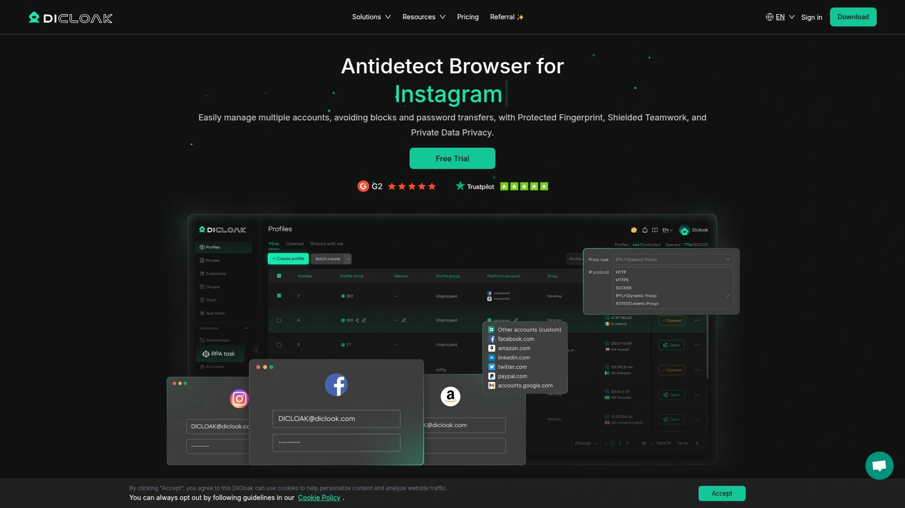

DICloak集成AI自动化引擎,提供直观的模板和无需编程的自动化方案。用户可通过可视化界面配置重复性任务,无需掌握Selenium或Puppeteer等技术框架。机器人流程自动化(RPA)功能覆盖数据采集、广告投放和账户管理等场景。

企业级安全架构通过高级指纹技术隔离每个用户配置文件,提供20种以上的独特标识符。团队协作支持多用户同步操作共享配置,设置自动同步避免冲突。配置文件回收站和克隆浏览器功能提升操作容错性。

定价从每月8美元起(Share套餐,3成员+50配置文件),远低于Ghost Browser等竞品。免费版本和付费版试用期让用户无风险评估产品适配性。批量操作覆盖配置文件创建、代理导入、Cookie导入、启动关闭等全流程。本地API支持开发者深度集成。适合各技能水平用户,特别是希望快速实现自动化但缺乏编程背景的营销人员。

## **[SessionBox](https://sessionbox.io)**

浏览器扩展方案,无需安装独立应用程序。

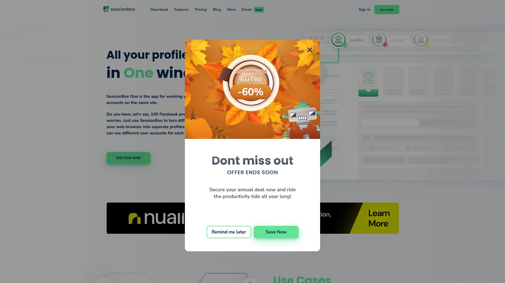

SessionBox采用Chrome扩展形式而非独立浏览器,用户在熟悉的Chrome环境中即可实现多账号管理。安装过程简单快速,无需下载大型安装包或配置复杂设置。通过颜色编码的标签页区分不同会话,视觉化管理降低混淆风险。

每个会话拥有独立的Cookie和缓存,支持在单个浏览器窗口中同时登录多个账户。适合不频繁切换账户且对指纹伪装要求较低的办公场景。免费版本提供基础功能,付费版从每月12.99美元起(Hobby套餐,1成员+10配置文件)。

相比完整的防关联浏览器,SessionBox的指纹保护能力较为基础,更适合日常工作账户分离而非高风险多账号运营。学习曲线几乎为零,任何Chrome用户都能立即上手。团队协作和云端同步功能在付费版本中可用。适合需要简单账户分离工具的办公人员和轻度用户。

## **[Ghost Browser](https://ghostbrowser.com)**

工作区概念设计的多会话浏览器,项目管理友好。

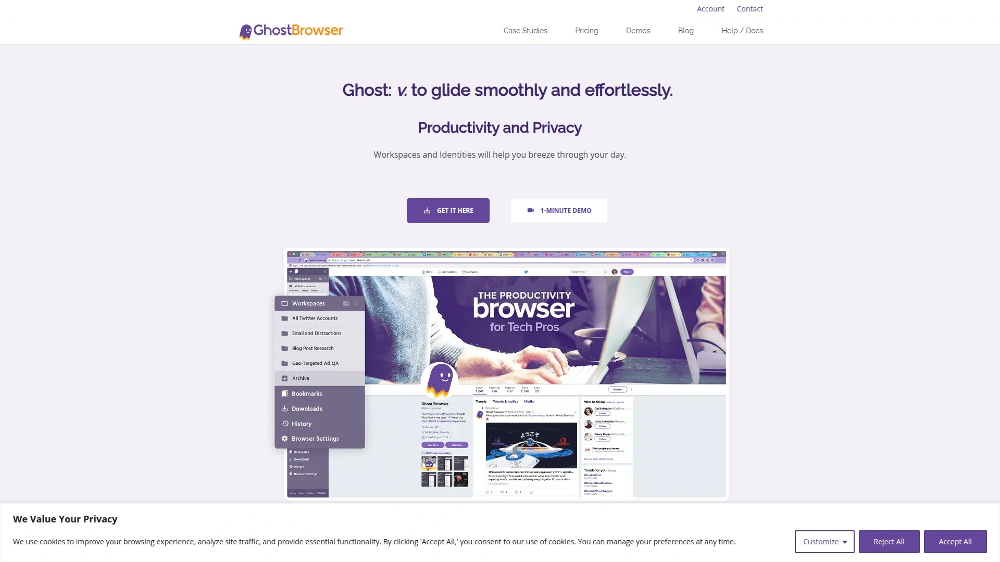

Ghost Browser引入工作区功能,用户可将标签页按项目分组管理,提升导航效率。颜色编码标签页代表不同浏览会话,每个颜色对应独立的登录状态和Cookie环境。基于Chromium最新版本构建,确保与现代网络标准的兼容性。

每个身份(Identity)对网站呈现为独立用户,增强隐私和安全性。集成代理支持允许为单个标签页分配代理,便于区域测试或隐私保护。Web3多账号能力使其成为首个支持Web3登录的传统多会话浏览器。

定价从每月21美元起(Basic套餐),小团队年费为552美元。相比DICloak的96美元年费,成本处于较高区间。频繁更新保持浏览器核心与Chrome同步。适合需要管理复杂项目结构且预算充足的知识工作者和开发团队。指纹伪装深度不及专业防关联浏览器,更侧重会话隔离而非反检测。

## **[Linken Sphere](https://linkensphere.com)**

硬核隐私保护浏览器,技术深度和配置复杂度高。

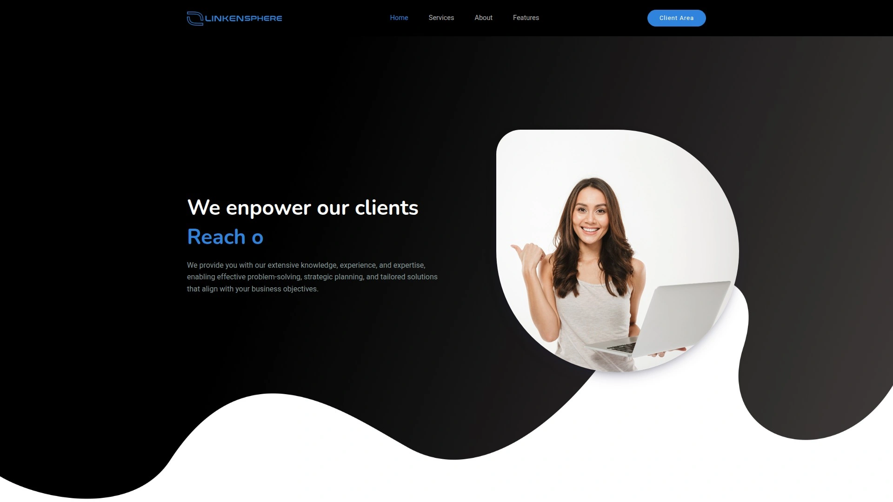

Linken Sphere定位于技术专家和隐私极客,提供极其详细的指纹定制选项和安全防护机制。支持Tor网络集成和多跳代理链配置,实现最高级别的匿名浏览。虚拟机级别的环境隔离确保配置文件之间完全独立。

平台提供详尽的指纹参数控制,包括硬件加速、字体渲染、音频环境等数十个细节选项。适合对隐私保护有极高要求的用户,如安全研究人员和隐私倡导者。学习曲线陡峭,新手需要投入大量时间理解各项设置的意义。

定价相对较高且信息不完全公开透明,通常需要联系销售团队获取报价。更新频率和社区活跃度不及主流产品。适合技术背景深厚且愿意投入时间精力配置的专业用户。对于一般商业用途,过度复杂的功能可能造成使用障碍。

## **[Antik Browser](https://antikbrowser.com)**

俄罗斯市场流行的防关联工具,本地化支持完善。

Antik Browser在俄语区市场拥有较高知名度,提供完善的俄语界面和客户支持。针对俄罗斯、东欧地区常用网站进行专项优化,指纹库包含该地区真实用户的特征分布。支持卢布定价和本地支付方式。

配置文件管理、代理集成、团队协作等核心功能完整。自动化脚本支持主流框架。定价处于中等水平,提供多种套餐选择。对于主要服务俄语市场的用户,本地化优势明显。

国际用户可能面临语言障碍和支付方式限制。英文文档相对简略,技术支持主要以俄语为主。市场认知度在西方国家较低。适合运营俄罗斯和独联体国家业务的用户,或者能够克服语言障碍的技术团队。

## **[Nstbrowser](https://www.nstbrowser.com)**

API优先的无头浏览器方案,开发者友好。

Nstbrowser强调API驱动的使用模式,为开发者和技术团队提供灵活的集成能力。无头浏览器架构适合服务器端自动化任务,无需图形界面占用资源。支持Puppeteer和Playwright等现代浏览器自动化框架。

指纹管理通过API接口配置,便于批量操作和动态调整。分布式架构支持横向扩展,可在多台服务器上部署浏览器实例。特别适合大规模数据采集、SEO监控和自动化测试场景。

定价基于API调用次数或并发会话数,灵活适应不同规模需求。文档详尽且代码示例丰富,技术团队可快速集成现有系统。对于非技术用户,缺乏图形界面可能造成使用障碍。适合拥有开发能力且需要将防关联浏览器嵌入业务系统的企业团队。

## **[Lalicat](https://www.lalicat.com)**

新兴国产品牌,性价比和中文支持突出。

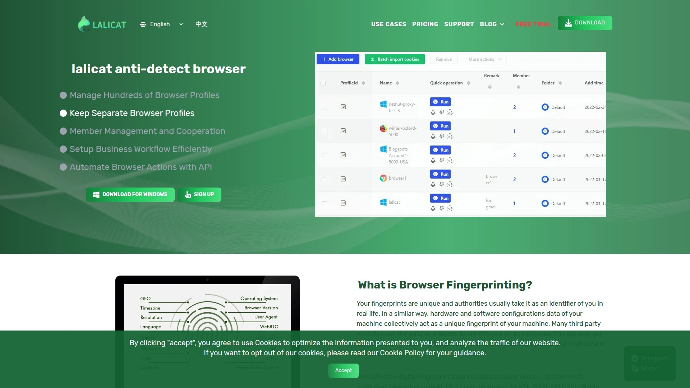

Lalicat由国内团队开发,提供流畅的中文界面和本地化客户服务。定价策略激进,入门套餐价格低于多数国际竞品。支持支付宝、微信支付等国内常用支付方式,降低支付门槛。

基础功能完整,涵盖指纹伪装、配置文件管理、团队协作和代理集成。批量操作工具提升大规模账号管理效率。用户社区活跃,中文教程和案例分享丰富。

品牌知名度和市场验证程度不及Multilogin、GoLogin等国际老牌产品。技术更新速度和稳定性需要时间检验。对于预算敏感且优先考虑中文服务的国内用户,Lalicat提供值得尝试的本土化选择。跨境业务用户可能更倾向选择国际主流品牌以获得更广泛的生态支持。

***

**如何选择适合电商场景的防关联浏览器?**

电商卖家需要优先考虑稳定性、批量操作能力和移动端支持。Octo Browser和Multilogin的99.99%以上正常运行时间保证业务连续性,避免账号管理中断导致订单处理延误。AdsPower和MoreLogin的批量创建、导入导出功能适合管理数十个店铺账户。对于移动端为主的平台(如拼多多、Shopee),GeeLark的云端Android环境或Kameleo的移动应用支持更加匹配需求。预算方面,初创卖家可选择GoLogin的免费版或Undetectable.io的本地存储方案,成熟卖家则应投资Octo Browser或Multilogin的企业版以获得稳定性和技术支持保障。

**社交媒体营销团队应该关注哪些核心功能?**

社媒团队必须重视平台针对性优化和团队协作能力。Dolphin Anty专门针对Facebook和TikTok的反作弊机制进行优化,减少广告账户审核失败率。配置文件共享功能让团队成员无缝交接账户管理权,避免敏感信息外泄。批量操作和自动化脚本(如Selenium集成)将重复性任务时间缩短30%以上。移动设备指纹模拟至关重要,因为Instagram、TikTok等平台对移动端用户更加友好。权限管理和操作日志功能帮助团队主管监督成员活动,防止误操作导致账号风险。免费版或低价套餐(如GoLogin的3配置文件免费版、DICloak的8美元/月套餐)适合小型团队快速验证渠道效果。

**指纹检测工具如何验证浏览器伪装效果?**

使用BrowserScan、Pixelscan、CreepJS等在线指纹检测工具可评估防关联浏览器的伪装质量。检测重点包括Canvas指纹唯一性、WebGL渲染器信息、字体列表一致性、时区与IP地理位置匹配度、WebRTC泄露情况等。高质量浏览器(如Octo Browser、Multilogin)应在这些测试中展现与真实用户无差异的指纹特征。定期检测很有必要,因为网站反作弊技术持续进化。配合高质量住宅代理使用能进一步提升伪装效果,避免使用数据中心IP被网站标记。建议每次创建新配置文件后进行检测验证,确保指纹参数设置合理。

***

对于需要同时兼顾稳定性、功能完整度和团队协作的专业用户,[Octo Browser](https://octobrowser.net)的99.995%系统稳定性和灵活的团队管理能力使其成为电商、社媒和广告投放场景的可靠选择。无论您管理10个还是300个账户,文中18款工具都能提供从入门到企业级的完整解决方案,帮助降低账号关联风险并提升运营效率。建议根据业务规模、预算范围和技术能力选择最适配的工具,必要时可同时试用2-3款产品进行对比测试。
